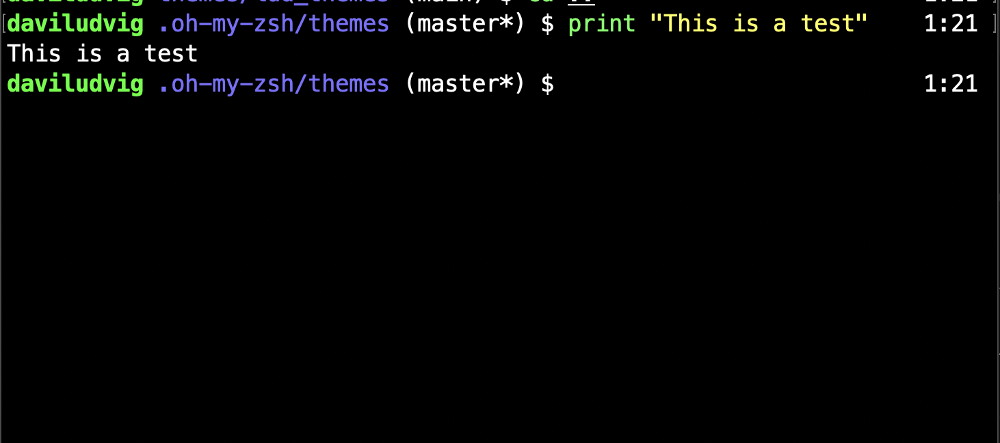

### Why should i use this?
* Well, this is a ZSH theme being built by a CS student. So by using this you are going to see a lot of good changes and well-looking improvements.

### How do i use this?
* You can read the proper instructions inside the Oh My ZSH repo.
[Official instructions from Oh My Zsh](https://github.com/ohmyzsh/ohmyzsh/wiki/Themes)

V1 looking:

